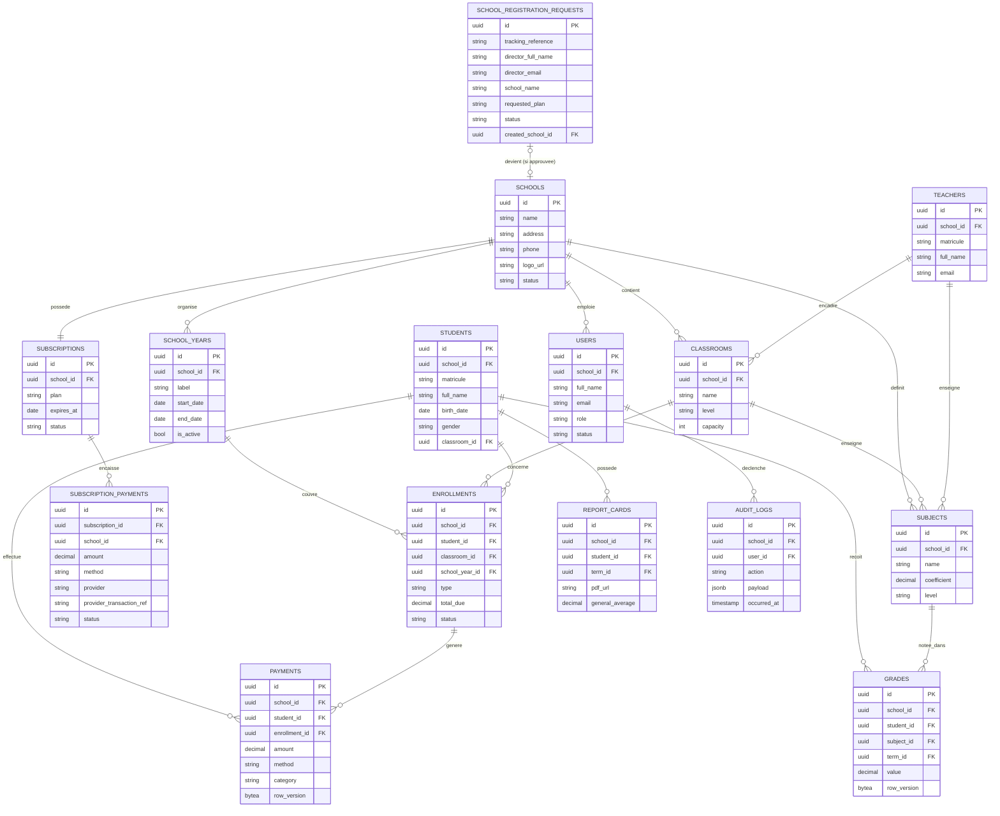

# Jangalekat — Diagramme Entité-Association (ERD)

Référence normative du schéma : `Volume_3_DDS.md`. Ce diagramme est une vue visuelle synthétique des entités cœur du MVP ; toute divergence avec le DDS doit être corrigée dans le DDS d'abord, puis répercutée ici.

Toutes les tables listées ci-dessous portent en plus (non représenté pour lisibilité) : `id UUID v7`, `created_at`, `updated_at`, `created_by`, `updated_by`, `is_deleted`, et — sauf `schools` et `subscriptions` — `school_id` (isolation multi-tenant, RLS).

## Notes de lecture

- `SUBSCRIPTIONS` n'a pas de `school_id` en tant que colonne de filtrage tenant — c'est l'entité qui *définit* le tenant, gérée exclusivement par le Super Admin (RLS différente, voir `Volume_3_DDS.md` §Multi-tenant, cas particulier).
- `GRADES` et `PAYMENTS` portent une colonne `row_version` : verrouillage optimiste obligatoire (Décision D-09, `Volume_0_Vision_Architecture.md` §0.13).
- `SCHOOL_REGISTRATION_REQUESTS` et `SUBSCRIPTION_PAYMENTS` sont des tables plateforme (comme `SUBSCRIPTIONS`) : pas de RLS par `school_id`, accès réservé au Super Admin (et, pour `SUBSCRIPTION_PAYMENTS` en lecture seule, au Directeur de l'école concernée). Voir Volume 1 §11.5-11.6, Volume 3 §5.7-5.8, Volume 7 §12bis.
- Le détail des contraintes, index, et policies RLS complètes est dans `Volume_3_DDS.md` — ce fichier n'a pas vocation à être exhaustif, seulement à donner une vue d'ensemble rapide à un agent avant de plonger dans le DDS.
